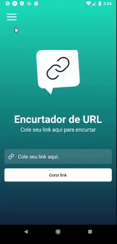

# Aplicativo MyLink
O aplicativo foi desenvolvido durante o evento "React Native Insider" disponibilizado pelo canal [SujeitoProgramador](https://www.instagram.com/sujeitoprogramador/). Foi um workshop de uma semana com cinco aulas e com o objetivo de desenvolver um aplicativo React Native para encurtar URLs. Para encurtar, é feita uma requisição a API do encurtador Bitly e seu resultado é retornado ao usuário e armazenado na memória do celular. 

##### Principais bibliotecas utilizadas: 

- Expo
- React Navigation (Stack e Drawer)
- AsyncStorage
- Axios
- Styled Components


##### Principais Funcionalidades:

- Encurtar URL e armazenar no celular
- Listar todas as URLs já encurtadas
- Remover URL da lista
- Compartilhar URL encurtada com outros aplicativos a partir da API Share do React Native: email, mensagens, Facebook, Whatsapp...
- Abrir webview a partir da URL gerada
- Copiar URL encurtada para o clipboard

##### Como testar o aplicativo:

Para executar/emular o aplicativo é necessário ter o Expo instalado na máquina. Após instalar, clone o repositório. Pode ser feito a partir do seguinte comando:

```sh
git clone https://github.com/charlanmttr/app-myLink.git
```

Após isso, instale as dependencias do projeto:
```sh
npm install
```
ou
```sh
yarn install
```

Por fim, execute:
```sh
expo start
```
Este último comando irá abrir uma nova guia no seu navegador. Nesta guia é possível testar o aplicativo diretamente no seu smartphone utilizando o QR code (é necessário ter o aplicativo ExpoGo no celular) ou abrir o aplicativo em algum emulador no seu computador clicando em `run on emulator`.

##### Demonstração:
